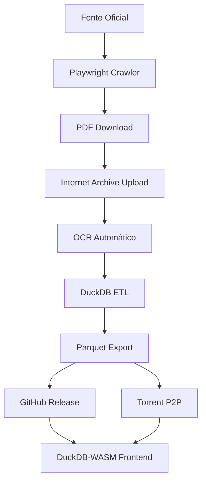
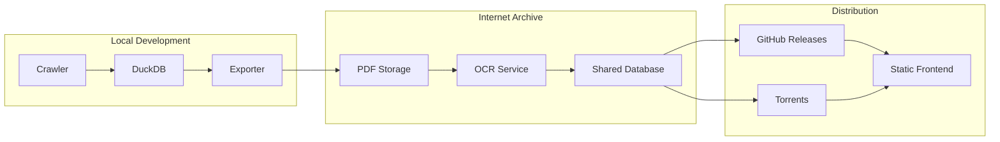

# 🛠️ Development Guide

Guia técnico para desenvolvimento diário no Leizilla.

## 📁 Estrutura de Pastas

```
leizilla/
├── src/leizilla/           # Código fonte principal
│   ├── __init__.py         # Entry point básico
│   └── (módulos futuros)   # crawler.py, extractor.py, etc.
├── tests/                  # Testes unitários
├── docs/                   # Documentação técnica
│   ├── adr/               # Architecture Decision Records
│   └── plans/             # Planos de features futuras
├── data/                   # Dados locais (não commitados)
│   └── .gitkeep           # Placeholder
├── .github/workflows/      # CI/CD automático
├── pyproject.toml         # Configuração Python + deps
├── Justfile              # Comandos de desenvolvimento
└── CONTRIBUTING.md       # Guia de contribuição
```

## 🗃️ DuckDB Local

### **Localização**
- **Path**: `data/leizilla.duckdb` (será criado automaticamente)
- **Gitignore**: Incluído, não será commitado
- **Backup**: Via Internet Archive (futuro)

### **Schema Planejado** (MVP)
```sql
-- Tabela principal de leis
CREATE TABLE leis (
  id VARCHAR PRIMARY KEY,
  titulo TEXT,
  data DATE,
  origem VARCHAR,  -- "rondonia", "federal", etc.
  url_original VARCHAR,
  texto_completo TEXT,
  metadados JSON,
  created_at TIMESTAMP DEFAULT CURRENT_TIMESTAMP
);

-- Índices para busca
CREATE INDEX idx_leis_data ON leis(data);
CREATE INDEX idx_leis_origem ON leis(origem);
```

### **Comandos DuckDB Úteis**
```bash
# Entrar no DuckDB interativo
duckdb data/leizilla.duckdb

# Verificar tabelas
.tables

# Ver schema
.schema leis

# Exportar para Parquet
COPY leis TO 'data/leis.parquet' (FORMAT PARQUET);
```

## 🌐 Variáveis de Ambiente

Crie `.env` na raiz do projeto:

```bash
# Internet Archive (para upload e OCR)
IA_ACCESS_KEY=your_access_key
IA_SECRET_KEY=your_secret_key

# Opcional: configuração de crawler
CRAWLER_DELAY=2000  # ms entre requests
CRAWLER_RETRIES=3
CRAWLER_TIMEOUT=30000  # ms

# Opcional: configuração DuckDB
DUCKDB_PATH=data/leizilla.duckdb
```

**Nunca commite `.env`!** Ele está no `.gitignore`.

## 🐳 Docker (Opcional)

### **Desenvolvimento**
```bash
# Build imagem
docker build -t leizilla:dev .

# Rodar com volume
docker run -it \
  -v $(pwd):/app \
  -v $(pwd)/data:/app/data \
  leizilla:dev bash

# Dentro do container
just setup
just test
```

### **Docker Compose** (futuro)
```yaml
version: '3.8'
services:
  leizilla:
    build: .
    volumes:
      - .:/app
      - ./data:/app/data
    environment:
      - DUCKDB_PATH=/app/data/leizilla.duckdb
```

## 🔍 Debug & Logs

### **Logging Básico**
```python
import logging

# Configure no módulo principal
logging.basicConfig(
    level=logging.INFO,
    format='%(asctime)s - %(name)s - %(levelname)s - %(message)s'
)

logger = logging.getLogger(__name__)
logger.info("Processando PDF: %s", filename)
```

### **Debug Crawler**
```bash
# Verbose mode (futuro)
python -m leizilla.crawler --verbose --debug

# Salvar logs
python -m leizilla.crawler > logs/crawler.log 2>&1
```

### **Debug DuckDB**
```python
import duckdb

# Enable query profiling
conn = duckdb.connect('data/leizilla.duckdb')
conn.execute("PRAGMA enable_profiling")
conn.execute("PRAGMA profiling_output = 'query_profile.json'")
```

## 📝 Como Adicionar ADR

1. **Crie arquivo numerado**:
   ```bash
   cp docs/adr/0001-projeto-estatico-duckdb-torrent.md \
      docs/adr/000X-sua-decisao.md
   ```

2. **Edite conteúdo**:
   - Contexto claro do problema
   - Alternativas consideradas
   - Decisão tomada e justificativa
   - Consequências esperadas

3. **Link no PR**:
   ```markdown
   ## ADR
   Esta PR implementa a decisão da ADR-000X: [Título](docs/adr/000X-sua-decisao.md)
   ```

## 📊 Diagramas Mermaid

### **Fluxo de Dados Completo**


### **Arquitetura de Componentes** (futuro)


## 🧪 Testes & Qualidade

### **Estrutura de Testes**
```
tests/
├── test_crawler.py        # Testes do crawler
├── test_extractor.py      # Testes de extração
├── test_database.py       # Testes DuckDB
├── conftest.py           # Fixtures pytest
└── fixtures/             # Dados de teste
    ├── sample.pdf
    └── expected_output.json
```

### **Mocking APIs Externas**
```python
import pytest
from unittest.mock import Mock, patch

@patch('requests.get')
def test_download_pdf(mock_get):
    mock_get.return_value.content = b'fake pdf content'
    # test implementation
```

### **Testes de Performance**
```python
import pytest
import time

@pytest.mark.performance
def test_duckdb_query_speed():
    start = time.time()
    # execute query
    duration = time.time() - start
    assert duration < 1.0  # Should be under 1 second
```

## 🚀 CI/CD Pipeline

### **GitHub Actions**
- **Lint**: ruff check + format
- **Type Check**: mypy
- **Tests**: pytest com coverage
- **Build**: Verificar se package instala

### **Comandos Locais**
```bash
# Simular CI completo
just ci

# Individual
just lint      # ruff check
just format    # ruff format
just typecheck # mypy
just test      # pytest
```

## 📚 Referências Úteis

### **Tecnologias Core**
- [DuckDB Python API](https://duckdb.org/docs/api/python/overview)
- [Playwright Python](https://playwright.dev/python/)
- [uv Package Manager](https://github.com/astral-sh/uv)
- [Internet Archive CLI](https://archive.org/developers/internetarchive/)

### **ADRs Existentes**
- [ADR-0001: Internet Archive como Pilar Central](adr/0001-projeto-estatico-duckdb-torrent.md)

### **Padrões do Projeto**
- **Conventional Commits**: `feat`, `fix`, `docs`, `style`, `refactor`, `test`
- **Python Style**: ruff defaults + type hints obrigatórios
- **File Organization**: src-layout com flat structure

---

## 🔧 Troubleshooting

### **uv não funciona**
```bash
# Instalar uv
curl -LsSf https://astral.sh/uv/install.sh | sh
# ou
pip install uv
```

### **DuckDB locked**
```bash
# Verificar processos
lsof data/leizilla.duckdb
# Matar se necessário
kill <PID>
```

### **Playwright não instala browsers**
```bash
playwright install
```

### **Testes falham por timeout**
```bash
# Aumentar timeout
pytest --timeout=60
```

Este guia será atualizado conforme o projeto evolui. Sempre consulte a versão mais recente no repositório.