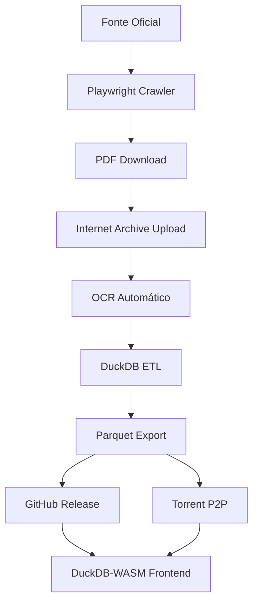
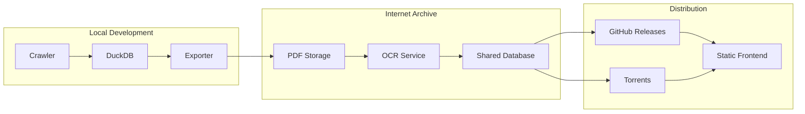

# 🛠️ Development Guide

Guia técnico para desenvolvimento diário no Leizilla.

## 📁 Estrutura de Pastas

```
leizilla/
├── src/                    # Código fonte (flat structure)
│   ├── config.py          # Configurações centralizadas
│   ├── crawler.py         # Playwright crawling
│   ├── storage.py         # Operações DuckDB
│   ├── publisher.py       # Upload para Internet Archive
│   └── cli.py             # Interface linha de comando
├── tests/                  # Testes unitários
│   ├── test_storage.py    # Testes do storage
│   └── test_crawler.py    # Testes do crawler
├── data/                   # Dados locais (gitignored)
│   ├── .gitkeep
│   ├── leizilla.duckdb    # Banco local (criado automaticamente)
│   └── temp/              # PDFs temporários
├── docs/                   # Documentação
│   ├── adr/               # Architecture Decision Records
│   └── DEVELOPMENT.md     # Este guia
├── .env.example           # Template de variáveis de ambiente
├── pyproject.toml         # Configuração Python
└── Justfile              # Comandos de desenvolvimento
```

## 🗃️ DuckDB Local

### **Localização**
- **Path**: `data/leizilla.duckdb` (será criado automaticamente)
- **Gitignore**: Incluído, não será commitado
- **Backup**: Via Internet Archive (futuro)

### **Schema Definido** (conforme ADR-0003)
```sql
-- Tabela principal de leis
CREATE TABLE leis (
  id VARCHAR PRIMARY KEY,                    -- "rondonia-lei-2025-001"
  titulo TEXT NOT NULL,
  numero VARCHAR,
  ano INTEGER,
  data_publicacao DATE,
  tipo_lei VARCHAR,                          -- "lei", "decreto", "portaria"
  origem VARCHAR NOT NULL,                   -- "rondonia", "federal", etc.
  texto_completo TEXT,                       -- OCR do Internet Archive
  texto_normalizado TEXT,                    -- Texto limpo para busca
  metadados JSON,                           -- Metadados flexíveis
  url_original VARCHAR,
  url_pdf_ia VARCHAR,                       -- URL do PDF no IA
  hash_conteudo VARCHAR,                    -- SHA-256 para deduplicação
  status VARCHAR DEFAULT 'ativo',
  created_at TIMESTAMP DEFAULT CURRENT_TIMESTAMP,
  updated_at TIMESTAMP DEFAULT CURRENT_TIMESTAMP
);

-- Índices principais
CREATE INDEX idx_leis_origem ON leis(origem);
CREATE INDEX idx_leis_ano ON leis(ano);
CREATE INDEX idx_leis_data ON leis(data_publicacao);
CREATE INDEX idx_leis_tipo ON leis(tipo_lei);
```

### **Comandos DuckDB Úteis**
```bash
# Entrar no DuckDB interativo
duckdb data/leizilla.duckdb

# Verificar tabelas
.tables

# Ver schema
.schema leis

# Exportar para Parquet
COPY leis TO 'data/leis_rondonia_2025.parquet' (FORMAT PARQUET)
WHERE origem = 'rondonia' AND ano = 2025;

# Busca por texto
SELECT id, titulo, ano FROM leis 
WHERE texto_normalizado LIKE '%meio ambiente%';

# Estatísticas básicas
SELECT origem, COUNT(*) as total FROM leis GROUP BY origem;
```

## 🌐 Variáveis de Ambiente

Crie `.env` na raiz do projeto:

```bash
# Internet Archive (para upload e OCR)
IA_ACCESS_KEY=your_access_key
IA_SECRET_KEY=your_secret_key

# Opcional: configuração de crawler
CRAWLER_DELAY=2000  # ms entre requests
CRAWLER_RETRIES=3
CRAWLER_TIMEOUT=30000  # ms

# Opcional: configuração DuckDB
DUCKDB_PATH=data/leizilla.duckdb
```

**Nunca commite `.env`!** Ele está no `.gitignore`.

## 🖥️ Interface de Linha de Comando

O Leizilla possui uma CLI completa para todas as operações:

### **Comandos Principais**
```bash
# Descobrir leis (crawling)
PYTHONPATH=src python -m cli discover --origem rondonia --year 2024

# Baixar PDFs descobertos
PYTHONPATH=src python -m cli download --origem rondonia --limit 10

# Upload para Internet Archive
PYTHONPATH=src python -m cli upload --limit 5

# Exportar dataset
PYTHONPATH=src python -m cli export --origem rondonia --year 2024

# Buscar leis no banco
PYTHONPATH=src python -m cli search --origem rondonia --text "meio ambiente"

# Estatísticas
PYTHONPATH=src python -m cli stats
```

### **Com uv (recomendado)**
```bash
# Descobrir e salvar leis
uv run --env-file .env python src/cli.py discover --origem rondonia

# Pipeline completo
uv run --env-file .env python src/cli.py discover --origem rondonia --year 2024
uv run --env-file .env python src/cli.py download --origem rondonia --limit 5
uv run --env-file .env python src/cli.py upload --limit 5
uv run --env-file .env python src/cli.py export --origem rondonia --year 2024
```

## 🔍 Debug & Logs

### **Logging Básico**
```python
import logging

# Configure no módulo principal
logging.basicConfig(
    level=logging.INFO,
    format='%(asctime)s - %(name)s - %(levelname)s - %(message)s'
)

logger = logging.getLogger(__name__)
logger.info("Processando PDF: %s", filename)
```

### **Debug Crawler**
```bash
# Verbose mode (futuro)
uv run python -m leizilla.crawler --verbose --debug

# Salvar logs
uv run python -m leizilla.crawler > logs/crawler.log 2>&1
```

### **Debug DuckDB**
```python
import duckdb

# Enable query profiling
conn = duckdb.connect('data/leizilla.duckdb')
conn.execute("PRAGMA enable_profiling")
conn.execute("PRAGMA profiling_output = 'query_profile.json'")
```

## 📝 Como Adicionar ADR

1. **Crie arquivo numerado**:
   ```bash
   cp docs/adr/0001-projeto-estatico-duckdb-torrent.md \
      docs/adr/000X-sua-decisao.md
   ```

2. **Edite conteúdo**:
   - Contexto claro do problema
   - Alternativas consideradas
   - Decisão tomada e justificativa
   - Consequências esperadas

3. **Link no PR**:
   ```markdown
   ## ADR
   Esta PR implementa a decisão da ADR-000X: [Título](docs/adr/000X-sua-decisao.md)
   ```

## 📊 Diagramas Mermaid

### **Fluxo de Dados Completo**


### **Arquitetura de Componentes** (futuro)


## 🧪 Testes & Qualidade

### **Estrutura de Testes**
```
tests/
├── test_crawler.py        # Testes do crawler
├── test_extractor.py      # Testes de extração
├── test_database.py       # Testes DuckDB
├── conftest.py           # Fixtures pytest
└── fixtures/             # Dados de teste
    ├── sample.pdf
    └── expected_output.json
```

### **Mocking APIs Externas**
```python
import pytest
from unittest.mock import Mock, patch

@patch('requests.get')
def test_download_pdf(mock_get):
    mock_get.return_value.content = b'fake pdf content'
    # test implementation
```

### **Testes de Performance**
```python
import pytest
import time

@pytest.mark.performance
def test_duckdb_query_speed():
    start = time.time()
    # execute query
    duration = time.time() - start
    assert duration < 1.0  # Should be under 1 second
```

## 🚀 CI/CD Pipeline

### **GitHub Actions**
- **Lint**: ruff check + format
- **Type Check**: mypy
- **Tests**: pytest com coverage
- **Build**: Verificar se package instala

### **Comandos Locais**
```bash
# Simular CI completo
just ci

# Individual
just lint      # ruff check
just format    # ruff format
just typecheck # mypy
just test      # pytest
```

## 📚 Referências Úteis

### **Tecnologias Core**
- [DuckDB Python API](https://duckdb.org/docs/api/python/overview)
- [Playwright Python](https://playwright.dev/python/)
- [uv Package Manager](https://github.com/astral-sh/uv)
- [Internet Archive CLI](https://archive.org/developers/internetarchive/)

### **ADRs Existentes**
- [ADR-0001: Internet Archive como Pilar Central](../adr/0001-projeto-estatico-duckdb-torrent.md)
- [ADR-0002: Frontend Estático Vanilla](../adr/0002-frontend-estatico-vanilla.md)
- [ADR-0003: Schema DuckDB para Leis](../adr/0003-schema-duckdb-leis.md)

### **Padrões do Projeto**
- **Conventional Commits**: `feat`, `fix`, `docs`, `style`, `refactor`, `test`
- **Python Style**: ruff defaults + type hints obrigatórios
- **File Organization**: src-layout com flat structure

---

## 🔧 Troubleshooting

### **uv não funciona**
```bash
# Instalar uv
curl -LsSf https://astral.sh/uv/install.sh | sh
# ou
pip install uv
```

### **DuckDB locked**
```bash
# Verificar processos
lsof data/leizilla.duckdb
# Matar se necessário
kill <PID>
```

### **Playwright não instala browsers**
```bash
uv run playwright install
```

### **Testes falham por timeout**
```bash
# Aumentar timeout
uv run pytest --timeout=60
```

Este guia será atualizado conforme o projeto evolui. Sempre consulte a versão mais recente no repositório.